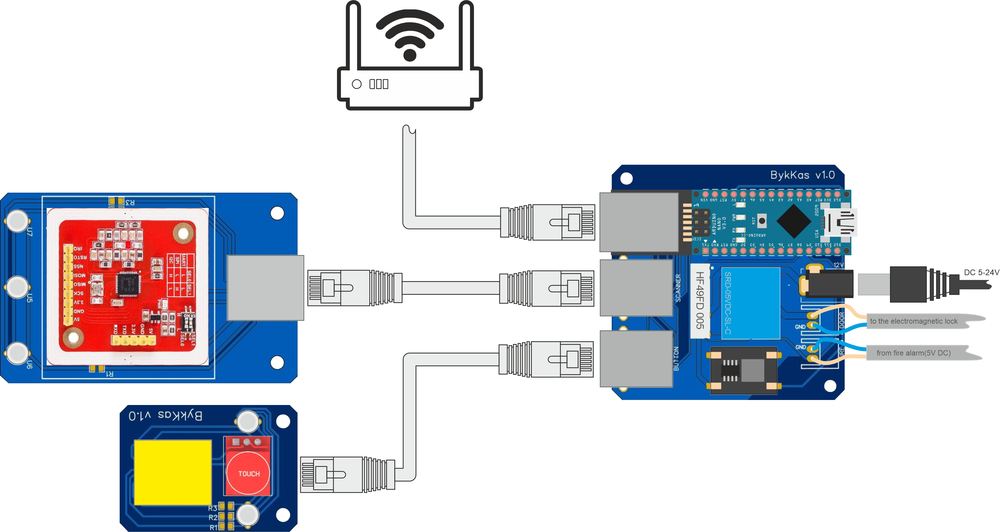

# Система контроля и управления доступом
Данная система использует модульное строение. При выходе отдельных модулей можно легко их поменять. 

Общая схема подключения:

Подключение осуществляется с помощью витых пар прямого обжима. 

подключать можно электромагнитные замки 12-24, используется блок питания с штекером зарядного устройства 5,5x2,5 мм. 
Параметры блока питания: сила тока БП > сила тока замка + 100мА

В конструкции платы управления предусмотрен вход для пожарной сигнализации на 5в для аварийного открытия дверей.

Вычисление права доступа происходит на [сервере](), на который отправляется серийный номер карточки, подключение к серверу осуществляется через TCP порт. Для подключения считывателя необходимо создать [файл конфигурации](). Возможна настройка для работы без сервера, через мастер карточку.

В [папке](3D_models) можно найти 3d модели для корпусов.

В [папке](Gerber) можно найти Gerber файлы для производства печатных плат.
Все необходимые компоненты можно найти в [таблице](parts.xlsx).
